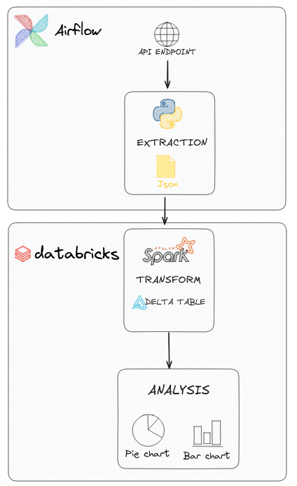

# bitcoin-databricks-etl

### PROJECT
This is my first project exploring databricks free edition. It consists in adaptating a 100% Python ETL to Databricks Intelligence Platform and explore a few of its features.

### STEPS
1. A local python script makes an API call to an get the latest 30 days of bitcoin prices in BRL and USD and upload it to Databricks landing zone
2. A Pyspark scripts parses the Json and make small transformations and save it to parquet
3. A SQL file generates a dataset for the dashboard of bitcoin daily prices in BRL 

### PIPELINE FLOW
